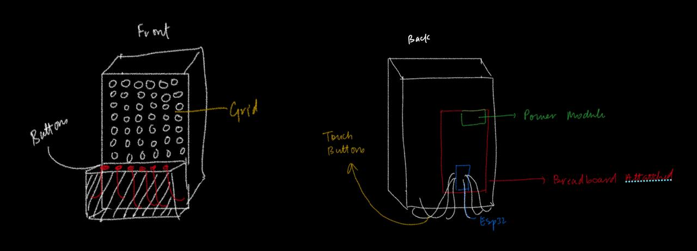
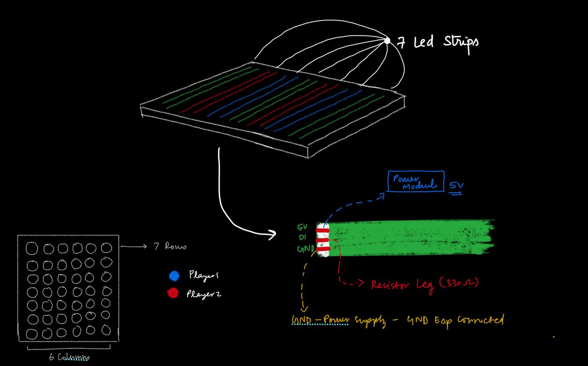
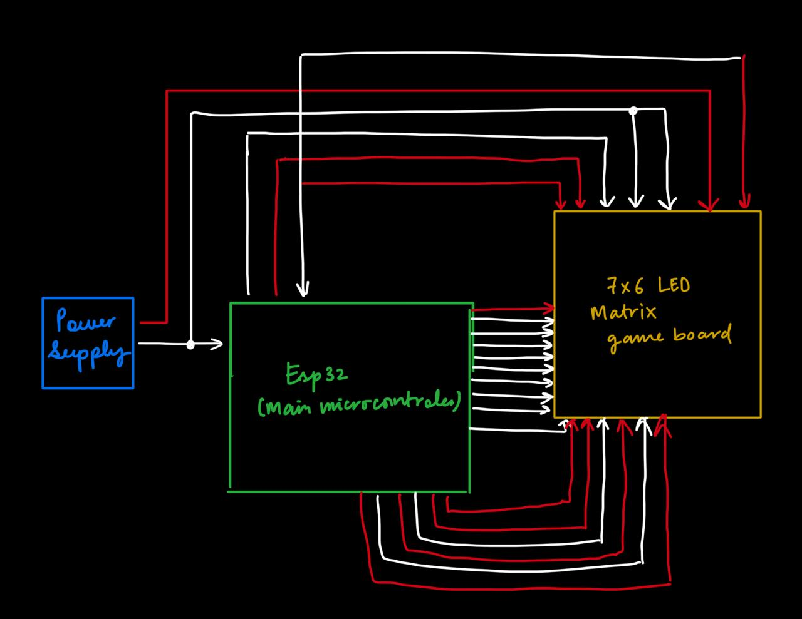
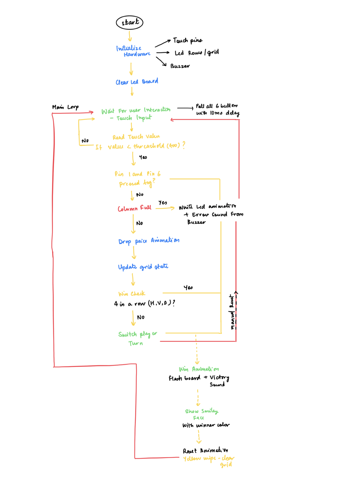

# Open Design and Technology  
## Final Project README

> **Project Weight:** 70%  
> **Team Size:** 2 students  
> **Project Duration:** 4 weeks  
> **Class Time Available:** 6 hours per class  
> **Total Time Available:** 48 effort-hours per team  
> **Project Type:** Playful, interactive, technology-based experience

---

# Before you begin

## Fork and rename this repository
After forking this repository, rename it using the format:

`ODT-2026-TeamName`

### Example
`ODT-2026-PixelWizards`

Do not keep the default repository name.

---

# How to use this README

This file is your team’s **working project document**.

You must keep updating it throughout the 4-week build period.  
By the final review, this README should clearly show:
- your idea,
- your planning,
- your design decisions,
- your technical process,
- your build progress,
- your testing,
- your failures and changes,
- your final outcome.

## Rules
- Fill every section.
- Do not delete headings.
- If something does not apply, write `Not applicable` and explain why.
- Add images, screenshots, sketches, links, and videos wherever useful.
- Update task status and weekly logs regularly.
- Use this file as evidence of process, not only as a final report.

---

# 1. Team Identity

## 1.1 Studio / Group Name
`Quad Link`

## 1.2 Team Members

| Name | Primary Role | Secondary Role | Strengths Brought to the Project |
|---|---|---|---|
| `Devshi Barman` | `Electronics + Coding` | `Fabrication` | `[Write here]` |
| `Samarth Saluja` | `Coding + Fabrication` | `Electronics` | `[Write here]` |

## 1.3 Project Title
`Connect 4`

## 1.4 One-Line Pitch
`A responsive, light-based Connect 4 where glowing pixels fall, react, and celebrate each move, turning a classic game into an interactive visual experience.`

## 1.5 Expanded Project Idea
In 1–2 paragraphs, explain:
- what your project is,
- what kind of playful experience it creates,
- what makes it fun, curious, engaging, strange, satisfying, competitive, or delightful,
- what technologies are involved.

**Response:**  
`This project is an interactive, light-based reimagining of Connect 4, built as a physical installation using an ESP32-controlled LED grid. Instead of static tokens, each move is visualized through glowing pixels that animate as they “fall” into place, creating a dynamic and responsive board. Players take turns from the same side, selecting columns via buttons, while the system updates in real time with color-coded feedback for each player. The board itself is designed as a diffused light surface, making each cell appear soft and luminous rather than harsh or digital.
The experience is playful and engaging because it transforms a familiar game into something more alive and sensory. The falling animation builds anticipation, the shifting colors make each turn visually distinct, and the moment of winning is amplified through light highlights and sound/music feedback.The project combines simple game logic with embedded electronics, using an ESP32, WS2812 LED strips, push-button inputs, and a buzzer, integrating code, material, and interaction design into a cohesive, responsive model.`

---

# 2. Philosophy Fit

## 2.1 Experience, Not Social Problem
This module does **not** require your project to solve a large social problem.

You are allowed to build:
- toys,
- games,
- interactive objects,
- playful machines,
- kinetic artifacts,
- humorous devices,
- strange but delightful experiences,
- things that are entertaining to use or watch.

## 2.2 What kind of experience are you creating?
Answer the following:
- What is the experience?
- What do you want the player or participant to feel?
- Why would someone want to try it again?

**Response:**  
`The experience is a tactile, light-driven reinterpretation of Connect 4, where players interact with a responsive surface instead of physical tokens. By touching a column, they trigger a glowing piece that “falls” through the grid, creating a real-time visual animation.
Each move builds tension in the players' mind as the light descends, while the soft glow and color shifts create a sense of immersion. There is also a subtle satisfaction in seeing cause and effect unfold instantly, touch leading to motion—making the interaction feel intuitive and responsive.
The experience invites repetition through its balance of familiarity and variation.The immediacy of interaction and the visual reward system encourage players to replay, experiment with moves, and engage both competitively and playfully.`

## 2.3 Design Persona
Complete the sentence below:

> We are designing this project as if we are a small creative studio making a **[toy / game / playable object / interactive experience]** for **[children / teens / adults / classmates / exhibition visitors / mixed audience]**.

**Response:**  
`We are designing this project as if we are a small creative studio making a **playable object / interactive light-based game** for a **mixed audience of classmates and exhibition visitors.`

---

# 3. Inspiration

## 3.1 References
List what inspired the project.

| Source Type | Title / Link | What Inspired You |
|---|---|---|
| `Board Game` | `Connect Four (classic vertical strategy game)` | `Core gameplay logic: gravity-based token drop, 2-player turn system, and “connect 4 in a row” win condition translated into a digital LED grid.` |
| `Interactive Installation` | `Light-based interactive art installations` | `Use of light as a responsive medium and creating an immersive, playful move that reacts to user input.` |

## 3.2 Original Twist
What makes your project original?

**Response:**  
`What makes our project original is the translation of a familiar, static board game into a dynamic, physical-digital experience. 
Instead of static pieces, moves are expressed through LED animations, touch input, and sound, making each action dynamic and engaging. The use of paired LEDs as “light pixels” and the falling animation adds a unique visual language. It shifts the game from something you simply play to something you physically interact with and experience.
To put it together, the originality lies not in reinventing the rules of the game, but in redesigning how the game is felt, seen, and experienced through interaction.`

---

# 4. Project Intent

## 4.1 Core Interaction Loop
Describe the main loop of interaction.

Examples:
- press → launch → score → reset
- connect → control → observe → repeat
- turn → trigger → react → repeat
- move object → sensor detects → sound/light response → player reacts

**Response:**  
`user input (touch) → system response (animated LED drop) → visual state update → turn transition → next input`

## 4.2 Intended Player / Audience

| Question | Response |
|---|---|
| Who is this for? | `Anyone who enjoys playful, interactive games and engaging with light-based experiences` |
| Age range | `10+ (teens to adults)` |
| Solo or multiplayer | `Multiplayer (2 players)` |
| Expected duration of one round | `2-5 Minutes` |
| What should the player feel? | `Focused, engaged, and responsive to the rhythm of play` |
| Is explanation required before use? | `Minimal but basic game rules may need a quick explanation` |

## 4.3 Player Journey
Describe exactly how a player will use the project.

1. **Approach:** `The player notices a  glowing grid that invites interaction through light rather than physical pieces.`
2. **Start:** `The system is already active; players understand they can begin by interacting with the surface.`
3. **First Action:** `The player touches one of the coloumn to make their move.`
4. **Main Interaction:** `Players take turns selecting columns, building their positions while observing the evolving pattern of lights.`
5. **System Response:** `The board responds instantly, lighting up a colored piece that animates as it “falls” into place, with subtle sound feedback reinforcing each move.`
6. **Win / Lose / End Condition:** `A round ends when a player connects four pieces, highlighted through a distinct light animation and sound, or when the board fills up.`
7. **Reset:** `After a short end animation, the board clears itself and returns to its initial state, ready for the next round.`

## 4.4 Rules of Play
If your project is a game, list the rules clearly.

- `A player can select only one column per turn; multiple inputs are not allowed, and the turn passes after a single move is made.`
- `Once a move is made and the piece is placed, it cannot be undone or changed.`
- `The win only counts if the four pieces of the same color are connected in a row, either horizontally, vertically, or diagonally.`
  

---

# 5. Definition of Success

## 5.1 Definition of “Playable”
Your project will be considered complete only if these conditions are met.

- [ ] `The system accurately detects touch input for all columns without delay or missed triggers.`
- [ ] `LED grid correctly maps and displays player moves in real-time with clear visuals.`
- [ ] `Turn-based interaction works smoothly, alternating between two players with distinct colors.`
- [ ] `Win condition is correctly detected when a player connects four in a row (only horizontal, vertical, or diagonal).`

## 5.2 Minimum Viable Version
What is the smallest version of this project that still delivers the core experience?

**Response:**  
`The smallest version of this project that still preserves the core experience is a 3 × 3 grid (Connect 3) with three input columns, simple LED feedback, two-player turn-taking, and basic win detection. 
This scaled-down version retains the essential interaction; players choose a column, a piece drops, the system updates, and a win condition is checked, creating a clear loop of action and response`

## 5.3 Stretch Features
What features are nice to have but not essential?

- `Sound feedback using a buzzer for piece drops and win events`
- `Animated LED fall transitions instead of instant lighting`
- `Reset animation or visual play when the game restarts`

---

# 6. System Overview

## 6.1 Project Type
Check all that apply.

- [check] Electronics-based
- [ ] Mechanical
- [check] Sensor-based
- [ ] App-connected
- [ ] Motorized
- [check] Sound-based
- [check] Light-based
- [ ] Screen/UI-based
- [check] Fabricated structure
- [check] Game logic based
- [check] Installation / tabletop experience
- [ ] Other: `[Write here]`

## 6.2 High-Level System Description
Explain how the system works in simple terms.

Include:
- input,
- processing,
- output,
- physical structure,
- app interaction if any.

**Response:**  
`The system is a compact, self-contained physical game built around touch input, simple game logic, and responsive feedback. Players interact using capacitive touch sensors mapped to each column of the grid. Each touch acts as a clear input, allowing the player to choose where their piece should be placed. The interaction is designed to feel immediate and intuitive, requiring no additional interface or instructions.
Once an input is received, the microcontroller processes it in real time. It handles turn-taking between two players, determines how the piece “falls” within the column, updates the internal game state, and continuously checks for win conditions. 
This layer of logic ensures that the game flows smoothly and enforces the rules without any manual intervention.
The output is delivered through an LED grid that visualizes the falling pieces and game state, along with a buzzer for basic sound feedback.
All components are integrated into a fabricated tabletop structure that holds the LED grid, sensors, and circuitry in a stable and accessible form. The system does not rely on any external app or screen, the entire experience is physical, direct, and designed to be understood through interaction alone.`

## 6.3 Input / Output Map

| System Part | Type | What It Does |
|---|---|---|
| `Capacitive Touch Sensors (6 columns)` | Input | `Detect player touch and map it to a specific column selection` |
| `ESP32 Microcontroller` | Processing | `Handles turn logic, piece placement, game state updates, and win detection` |
| `LED Grid` | Output | `Visually represents the board, player moves, and game progression using color` |
| `Buzzer` | Output | `Provides sound feedback for actions like piece drop and win events` |
| `Fabricated Game Structure` | Physical Action | `Holds and organizes all components into a stable, playable tabletop form` |

---

# 7. Sketches and Visual Planning

## 7.1 Concept Sketch
Add an early sketch of the full idea.

**Insert image below:**  


Example:
```md

```

## 7.2 Labeled Build Sketch
Add a sketch with labels showing:
- structure,
- electronics placement,
- user touch points,
- moving parts,
- output elements.

**Insert image below:**  


## 7.3 Approximate Dimensions

| Dimension | Value |
|---|---|
| Length | `40 cm` |
| Width | `30 cm` |
| Height | `40 cm` |
| Estimated weight | `Around 1Kg` |

---

# 8. Mechanical Planning

## 8.1 Mechanical Features
Check all that apply.

- [ ] Gears
- [ ] Pulleys
- [ ] Belt drives
- [ ] Linkages
- [ ] Hinges
- [ ] Shafts
- [ ] Springs
- [ ] Bearings
- [ ] Wheels
- [ ] Sliders
- [ ] Levers
- [check] Not applicable

## 8.2 Mechanical Description
Describe the mechanism and what it is meant to do.

**Response:**  
`The system does not rely on any active mechanical mechanisms for movement or transformation. Instead, it is built as a static fabricated structure designed to support and organize the electronic components.
Rather, the physical build organizes the LED grid for clear readability and places the touch sensors for easy access. It maintains stability, spacing, and alignment so the interaction feels precise and consistent. Any “movement,” like pieces falling, is simulated through LEDs rather than physical mechanisms.`

## 8.3 Motion Planning
If something moves, explain:
- what moves,
- what causes the movement,
- how far it moves,
- how fast it moves,
- what could go wrong.

**Response:**  
`There is no physical movement in the system; all motion is simulated through LED behavior.
Led Motions includes the “moving” element is the visual representation of a game piece falling down a column. This is triggered by a player’s touch input, after which the microcontroller updates the LEDs sequentially to mimic downward motion.
Since the motion is digital, potential issues include delayed input detection, inconsistent LED updates, or timing glitches that may disrupt the illusion of smooth movement.`

## 8.4 Simulation / CAD / Animation Before Making
If your project includes mechanical motion, document the digital planning before fabrication.

| Tool Used | File / Link | What Was Tested |
|---|---|---|
| `N/A` | `N/A` | `N/A` |
| `N/A` | `N/A` | `N/A` |

## 8.5 Changes After Digital Testing
What changed after the CAD, animation, or simulation stage?

**Response:**  
`N/A`

---

# 9. Electronics Planning

## 9.1 Electronics Used

| Component | Quantity | Purpose |
|---|---:|---|
| `[ESP32]` | `1` | `Main controller handling input, logic, and output` |
| `LED Strip` | `1` | `Creates the visual game grid and displays player moves` |
| `Capacitive Touch Sensors (GPIO touch pins)` | `6` | `Detect player input for each colum` |
| `Buzzer` | `1` | `Provides sound feedback for actions and win events` |
| `Resistors / Connecting Wires` | `Around 40` | `Ensure stable connections and circuit integrity` |
| `Power Supply` | `1` | `Powers the entire system` |

## 9.2 Wiring Plan
Describe the main electrical connections.

**Response:**  
`Power Distribution -
The ESP32 is powered via a 5V USB supply. The same power source is used to drive the LED strip, ensuring consistent brightness across the grid. A common ground is maintained between all components (ESP32, LEDs, buzzer, and touch inputs) to ensure stable signal flow and prevent noise issues.
LED Connections -
The NeoPixel LED strip is connected to a single digital output pin on the ESP32. This pin sends data signals that control the color and state of each LED in the grid. The strip receives 5V power and ground directly, while the data line is optionally passed through a resistor to stabilize the signal.
Touch Input Connections -
Each column is mapped to a dedicated capacitive touch pin on the ESP32. No external wiring is required beyond connecting conductive pads or wires to the touch pins, making the input system minimal
Buzzer Connection -
The buzzer is connected to a digital output pin on the ESP32. The buzzer shares the common ground with the rest of the system.
All components are wired back to the ESP32, which acts as the central hub.`

## 9.3 Circuit Diagram
Insert a hand-drawn or software-made circuit diagram.

**Insert image below:**  


## 9.4 Power Plan

| Question | Response |
|---|---|
| Power source | `[USB 5V` |
| Voltage required | `5V for LED strip, 3.3V logic for ESP32` |
| Current concerns | `LED strip can draw higher current at full brightness; brightness is limited in code to prevent overload` |
| Safety concerns | `Ensure common ground, avoid loose connections, and prevent overheating` |

---

# 10. Software Planning

## 10.1 Software Tools

| Tool / Platform | Purpose |
|---|---|
| `[MicroPython` | `Writing and running the game logic on the ESP32` |
| `Thonny` | `Uploading code to the ESP32 and debugging` |

## 10.2 Software Logic
Describe what the code must do.

Include:
- startup behavior,
- input handling,
- sensor reading,
- decision logic,
- output behavior,
- communication logic,
- reset behavior.

**Response:**  
`Startup Behavior -
On powering up, the system initializes the ESP32, sets up all touch input pins, configures the LED grid, and clears any previous state. The board starts in a neutral state with all LEDs off or showing a default pattern, ready for the first player.
Input Handling -
The system continuously listens for touch input from the capacitive sensors. Each sensor corresponds to a column, and a valid touch is registered once it crosses a defined threshold to avoid false triggers.
Sensor Reading -
Touch values are read in real time and filtered to ensure quick but stable detection. Sensitivity is tuned so inputs feel responsive without accidental activation.
Decision Logic -
Once a valid input is detected, the system checks whose turn it is, finds the lowest available position in the selected column, and updates the internal game state. It then checks for a win condition
Output Behavior -
The LED grid updates to show the new piece placement using the current player’s color. A short animation simulates the piece “falling” into place. The buzzer provides feedback for actions like a move or a win.
Communication Logic-
There is no external communication; all processing happens locally on the ESP32.
Reset Behavior -
After a win or draw, the system plays a simple feedback pattern and then resets the board either automatically or manually, preparing for a new game.`

## 10.3 Code Flowchart
Insert a flowchart showing your code logic.

Suggested sequence:
- start,
- initialize,
- wait for input,
- read input,
- decision,
- trigger output,
- repeat or reset,
- error handling.

**Insert image below:**  


## 10.4 Pseudocode

```text
START

INITIALIZE:
    Set grid size (7 rows × 6 columns)
    Initialize touch sensors for each column
    Initialize LED rows
    Initialize buzzer
    Set current player = Player 1
    Clear board

LOOP forever:

    CHECK manual reset:
        IF both edge sensors are touched:
            Run reset animation
            Reset grid
            Set current player = Player 1
            CONTINUE loop

    FOR each column:
        Read touch value

        IF touch detected AND it was not touched before:
            HANDLE MOVE for that column

    Small delay

END LOOP


FUNCTION HANDLE MOVE(column):

    IF top of column is filled:
        Play invalid move animation
        RETURN

    FIND lowest empty row in column

    PLACE current player's piece in grid

    PLAY drop sound

    ANIMATE piece falling down the column using LEDs

    IF current player wins:
        Play win animation (lights + sound)
        Show smiley
        Reset game
        RETURN

    SWITCH player


FUNCTION CHECK WIN(player):

    CHECK horizontal matches of 4
    CHECK vertical matches of 4
    CHECK diagonal (both directions) matches of 4

    IF any match found:
        RETURN TRUE
    ELSE:
        RETURN FALSE


FUNCTION INVALID MOVE ANIMATION(column):

    Flash column in white
    Play descending error tones
    Restore original colors


FUNCTION WIN ANIMATION(player):

    Fill board with player color
    Play melody with blinking lights
    Show smiley face


FUNCTION RESET ANIMATION:

    Clear board
    Sweep yellow across columns
    Clear board again
    Reset grid
    Set current player = Player 1


FUNCTION CHECK MANUAL RESET:

    IF first AND last touch sensors are pressed:
        RETURN TRUE
    ELSE:
        RETURN FALSE
```

---

# 11. MIT App Inventor Plan

## 11.1 Is an app part of this project?
- [ ] Yes
- [check ] No

If yes, complete this section.

## 11.2 Why is the app needed?
Explain what the app adds to the experience.

Examples:
- remote control,
- score tracking,
- mode selection,
- personalization,
- triggering effects,
- displaying data.

**Response:**  
`N/A`

## 11.3 App Features

| Feature | Purpose |
|---|---|
| `N/A` | `N/A` |
| `N/A` | `N/A` |
| `N/A` | `N/A` |

## 11.4 UI Mockup
Insert a sketch or screenshot of the app interface.

**Insert image below:**  
`N/A`

## 11.5 App Screen Flow

1. `N/A`
2. `N/A`
3. `N/A`
4. `N/A`

---

# 12. Bill of Materials

## 12.1 Full BOM

| Item | Quantity | In Kit? | Need to Buy? | Estimated Cost | Material / Spec | Why This Choice? |
|---|---:|---|---|---:|---|---|
| `ESP32` | `1` | `Yes` | `No` | `NA` | `ESP32` | `Main microcontroller` |
| `Power supply module` | `4` | `Yes` | `Yes` | `90` | `MB102 breadboard power supply` | `Power supplies overloaded during experimentation` |
| `Jumper wires` | `1 pack` | `Yes` | `Yes` | `60` | `standard jumper cables` | `Needed Extra wires` |
| `LED Strips` | `3 meteres]` | `no` | `Yes` | `600` | `WS2812B RGB Individually Addressable Pixel LED Strip` | `To represent the disks in connect four` |
| `resistors` | `7` | `Yes` | `No` | `NA` | `330ohm` | `regulate current between led strips and esp32` |
| `Servo Motors` | `2` | `NO` | `yes` | `[800]` | `MG995 servos motors` | `needed for the previous idea but we had to change it due to time constraints` |
| `Breadboard` | `2` | `Yes` | `No` | `NA` | `Standard` | `to manage the connections` |
| `LDR sensors` | `4` | `No` | `Yes` | `200` | `12mm Ldr sensors` | `needed for the previous idea but we had to change it due to time constraints` |
| `Led Strip` | `1 meter` | `No` | `yes` | `200` | `Analog Led Strip` | `Wrong kind of Led strip` |


## 12.2 Material Justification
Explain why you selected your main materials and components.

Examples:
- Why acrylic instead of cardboard?
- Why MDF instead of 3D print?
- Why servo instead of DC motor?
- Why bearing instead of a plain shaft hole?

**Response:**  
`We selected our materials and components based on a balance of efficiency, functionality, and feasibility within our constraints.

For the main structure, we chose laser-cut MDF instead of 3D printing. While 3D printing could have offered more complex forms, it would have been significantly more time-consuming and less reliable given ongoing electricity constraints. Laser cutting allowed us to produce precise, repeatable parts quickly and assemble them efficiently.

For the lighting system, we used seven individually addressable LED strips rather than discrete LEDs or analog LED strips. This choice was both cost-effective and easier to manage in terms of wiring and installation. More importantly, individually addressable LEDs gave us full control over each LED, allowing dynamic color changes and interactive feedback. This level of control would not have been possible with analog strips or individual LEDs without significantly increasing complexity.

We opted for touch-pin inputs instead of physical buttons to explore capacitive touch as an interaction method. This made the interface feel more seamless and integrated into the surface rather than relying on protruding mechanical components. To improve usability, we wrapped the touch points in aluminium foil, which increased the effective contact area and made touch detection more responsive and reliable.

Overall, each material and component was chosen to simplify fabrication, enhance interactivity, and stay within practical time and resource constraints while still allowing flexibility in design and functionality.`

## 12.3 Items to Purchase Separately

| Item | Why Needed | Purchase Link | Latest Safe Date to Procure | Status |
|---|---|---|---|---|
| `addressable led strip` | `indivisual color code each neopixel` | `Store bought` | `18 April` | `Received` |

## 12.4 Budget Summary

| Budget Item | Estimated Cost |
|---|---:|
| Electronics | `[2200]` |
| Mechanical parts | `[500]` |
| Fabrication materials | `[200]` |
| Purchased extras | `[400]` |
| Contingency | `[400]` |
| **Total** | `[3700]` |

## 12.5 Budget Reflection
If your cost is too high, what can be simplified, removed, substituted, or shared?

**Response:**  
`he overall cost of the project increased primarily due to changes in our initial concept. Our earlier design required two MG995 servo motor units, which significantly added to the electronics budget. Although we later shifted direction, this early investment contributed to the higher overall cost.

Another factor was the need to replace multiple power supplies. During early experimentation with servos and LED systems, we overloaded and damaged a few units, which led to additional unplanned expenses.

We also purchased extra components as a precaution, since sourcing parts involved ordering from a store in Thane and included delivery costs. To avoid delays, we opted to have backups on hand, which further increased spending.

If the budget needed to be reduced, we could simplify the system by minimizing high-power components, limiting redundant purchases, and planning procurement more efficiently to avoid excess orders and delivery charges.]`

---

# 13. Planning the Work

## 13.1 Team Working Agreement
Write how your team will work together.

Include:
- how tasks are divided,
- how decisions are made,
- how progress will be checked,
- what happens if a task is delayed,
- how documentation will be maintained.

**Response:**  
`We plan to divide responsibilities based on individual strengths while still working collaboratively throughout. Electronics and wiring will be handled by Devshi, fabrication and physical modeling by Samarth, and coding will be developed jointly, with both members contributing and iterating together.

Decisions will be made through open discussion, exploring different possibilities before finalizing an approach. The focus will be on avoiding conflicts and finding a balanced middle ground that works for the project.

Progress will be reviewed through team sessions on alternate days, where we will share updates, track development, and discuss any new ideas or changes.

If a task is delayed, the team will avoid rushing and instead understand the reason behind the delay, adjusting the plan accordingly while maintaining quality.

Documentation will be maintained continuously by updating the project repository, taking photos of progress, and noting key decisions and iterations throughout the process.`

## 13.2 Task Breakdown

| Task ID | Task | Owner | Estimated Hours | Deadline | Dependency | Status |
|---|---|---|---:|---|---|---|
| T1 | `Initial concept exploration` | `Team` | `2` | `Week 1` | `None` | `Done` |
| T2 | `Basic component setup (ESP32, LEDs, touch)` | `Team` | `2` | `Week 2` | `T1` | `Done` |
| T3 | `Early testing (input + output trials)` | `Team` | `3` | `week 3` | `T2/T1` | `Did not complete` |
| T4 | `Define Connect 4 interaction and grid system` | `team` | `3` | `week 4` | `N/A` | `Done` |
| T5 | `Build core game logic` | `team` | `4` | `week 4` | `T4` | `Done` |
| T6 | `Implement LED animations and visual feedback` | `Devshi` | `4` | `week 4` | `T5` | `Done` |
| T7 | `Integrate touch input with full system` | `team` | `3` | `week 4` | `T5` | `Done` |
| T8 | `Add sound feedback and error handling` | `samarth` | `3` | `week 4` | `T7` | `Done` |
| T9 | `Playtesting, refinement, and final documentation` | `team` | `3` | `week 4` | `T8` | `Done` |

## 13.3 Responsibility Split

| Area | Main Owner | Support Owner |
|---|---|---|
| Concept and gameplay | `Both` | `Both` |
| Electronics | `Devshi` | `Samarth` |
| Coding | `Both` | `Both` |
| App | `N/A` | `N/A` |
| Mechanical build | `Samarth` | `Devshi` |
| Testing | `Samarth` | `Devshi` |
| Documentation | `Devshi` | `Samarth` |

---

# 14. Weekly Milestones

## 14.1 Four-Week Plan

### Week 1 — Plan and De-risk
Expected outcomes:
- [ ] Idea finalized
- [ ] Core interaction decided
- [ ] Sketches made
- [ ] BOM completed
- [ ] Purchase needs identified
- [ ] Key uncertainty identified
- [ ] Basic feasibility tested

### Week 2 — Build Subsystems
Expected outcomes:
- [ ] Electronics tests completed
- [ ] CAD / structure planning completed
- [ ] App UI started if needed
- [ ] Mechanical concept tested
- [ ] Main subsystems partially working

### Week 3 — Integrate
Expected outcomes:
- [ ] Physical body built
- [ ] Electronics integrated
- [ ] Code connected to hardware
- [ ] App connected if required
- [ ] First playable version exists

### Week 4 — Refine and Finish
Expected outcomes:
- [ ] Technical bugs reduced
- [ ] Playtesting completed
- [ ] Improvements made
- [ ] Documentation completed
- [ ] Final build ready

## 14.2 Weekly Update Log

| Week | Planned Goal | What Actually Happened | What Changed | Next Steps |
|---|---|---|---|---|
| Week 1 | `Explore idea of an auto-follow solar flower (light-tracking object)` | `Researched how light sensors work and how to detect direction of light. Sketched initial concepts for a flower that rotates toward light` | `Realized the project would require both electronic sensing + mechanical movement, making it more complex than expected.` | `start exploring movement` |
| Week 2 | `Build working prototype for movement` | `Mechanical movement (servo control) was inconsistent.` | `Began reconsidering whether the interaction could be expressed differently without heavy mechanical dependency.` | `Re-evaluate project direction and explore alternative interaction formats.` |
| Week 3 | `Planned to design a physical structure using 3D printing for the flower mechanism.` | `Due to time constraints, shifted to laser cutting as a faster alternative. However, the lab was fully booked and we couldn’t get access to the machine.` | `Due to lack of access (lab constraints) and time limitations, we decided to move away from a mechanically dependent solution of this model` | `[Re-evaluate project direction and explore alternatives, while simultaneously figuring out ways to work the model` |
| Week 4 | `Finalize working prototype and complete project` | `Pivoted away from the solar flower and shifted to building an interactive LED-based game using available components. Designed and developed the Connect 4 system in a short span` | `Major shift from kinetic object → interactive system. Prioritized responsiveness, clarity, and user experience over mechanical complexity.` | `Final testing, debugging, and documentation for submission.` |

---

# 15. Risks and Unknowns

## 15.1 Risk Register

| Risk | Type | Likelihood | Impact | Mitigation Plan | Owner |
|---|---|---|---|---|---|
| `Mechanical system (solar flower) too complex to execute` | `Mechanical` | `High` | `High` | `Simplify or pivot to non-mechanical interaction` | `Team` |
| `Touch sensors give inconsistent readings` | `Technical` | `High` | `High` | `Tune threshold, use edge detection for stable input` | `Team` |
| `LED mapping / display errors` | `Technical` | `Medium` | `Medium` | `Test row-by-row and standardize indexing` | `Team` |
| `Game logic bugs (win detection / move errors)` | `Technical` | `Medium` | `High` | `Test edge cases and debug iteratively` | `Team` |

## 15.2 Biggest Unknown Right Now
What is the single biggest uncertainty in your project at this stage?

**Response:**  
`The biggest uncertainty is the **consistency of touch input during real use**. While the system works in testing, touch sensors can behave differently with changes in environment, user interaction, or electrical noise. Ensuring that inputs remain reliable and responsive across different users and conditions is the key challenge.`

---

# 16. Testing and Playtesting

## 16.1 Technical Testing Plan

| What Needs Testing | How You Will Test It | Success Condition |
|---|---|---|
| `Touch sensor inpu` | `Repeatedly tap each sensor across different speeds and pressures` | `Each touch is detected instantly with no false triggers or missed inputs` |
| `Falling animation` | `Drop discs in all columns multiple times` | `Smooth top-to-bottom motion with no flickering or skipped positions` |
| `Game logic (win detection)` | `Simulate horizontal, vertical, and diagonal wins` | `All valid win conditions are detected accurately every time` |
| `Invalid move handling` | `Fill a column and attempt another move` | `System blocks move and shows correct visual + sound feedback` |
| `Sound feedback` | `Trigger drop, error, and win scenarios` | `Sound plays correctly and stops without overlapping` |
| `Reset interaction` | `Trigger manual reset using touch combination (1st and 6th buttons)` | `Board clears fully and game restarts reliably` |

## 16.2 Playtesting Plan

| Question | How You Will Check |
|---|---|
| Do players understand what to do? | `Observe first-time users playing without instructions and note if they can start and continue the game independently` |
| Is the interaction satisfying? | `User feedback after playing and observe reactions to animations, sound, and touch response` |
| Do players want another turn? | `Check if players voluntarily replay or ask to play again after one round` |
| Is the challenge balanced? | `Calculate duration - whether players remain engaged and if games feel neither too short nor too repetitive` |
| Is the response clear and immediate? | `Monitor if users notice any delay or confusion between touch input and system feedback (LED + sound` |

## 16.3 Testing and Debugging Log

| Date | Problem Found | Type | What You Tried | Result | Next Action |
|---|---|---|---|---|---|
| `[Date]` | `[Describe issue]` | `[Technical / Mechanical / UI / Gameplay]` | `[What you did]` | `[Worked / Partly / Failed]` | `[Next step]` |
| `[Date]` | `[Describe issue]` | `[Type]` | `[What you did]` | `[Result]` | `[Next step]` |

## 16.4 Playtesting Notes

| Tester | What They Did | What Confused Them | What They Enjoyed | What You Will Change |
|---|---|---|---|---|
| `Peer` | `Interacted with the setup, initially unsure how to start` | `Couldn’t immediately identify the game` | `Once told it was Connect 4, they quickly understood and engaged with the gameplay` | `Add a simple visual cue or label to indicate the game and basic interaction` |
| `Classmate` | `Tried pressing different touch inputs to understand response` | `Unsure how the buttons mapped to the game and what each touch did along with sensitivity rate` | `Enjoyed the falling animation, sound feedback, and overall responsiveness (the smiley in the end)` | `Make input mapping clearer` |

---

# 17. Build Documentation

## 17.1 Fabrication Process
Describe how the project was physically made.

Include:
- cutting,
- 3D printing,
- assembly,
- fastening,
- wiring,
- finishing,
- revisions.

**Response:**  
`We began the fabrication process by prototyping the layout of the LEDs on a foam board base to determine accurate spacing and positioning. Once finalized, we soldered wires onto the LED strips and mapped out all the required electrical connections, including the LED circuitry and touch-button inputs.

For the initial structure, the breadboard and components were mounted onto the foam board, creating a stable internal base. Wires were organized and secured using electrical tape and adhesive to ensure reliability and reduce movement during handling.

The outer enclosure was then produced through laser cutting MDF panels. During assembly, we partially constructed the enclosure before inserting the internal system of circuits and LEDs. A layer of butter paper was added as a diffuser to soften and evenly distribute the LED light.

After integrating all internal components, the enclosure was fully assembled and fastened using adhesive. Some adjustments were required during this stage, particularly revising the button wiring, as the original wire lengths were insufficient for the enclosure dimensions. The connections were modified accordingly to ensure proper fit and functionality.

Finally, the build was closed and finished into a compact unit, with only the essential external connections, the power cable and ESP32 interface, accessible from the outside.]`

## 17.2 Build Photos
Add photos throughout the project.

Suggested images:
- early sketch,
- prototype,
- electronics testing,
- mechanism test,
- app screenshot,
- final build.

Example:


## 17.3 Version History

| Version | Date | What Changed | Why |
|---|---|---|---|
| `v1` | `[18/04/26]` | `Basic Connections and prototype with wires as buttons` | `To test out the connections and see if the power supply is able to handle all the led strips along with checking functionality of the touchpins` |
| `v2` | `[19/04/26]` | `Final buttons along with a basic mount for the breadboard and main board that has the leds stuck on it, the game functions as wanted perfectly now, but the structure is still just barebones` | `To prepare the internal mechanism before inserting it in the final casing` |
| `v3` | `[20/04/26]` | `Final Build with laser cut outer casing, buttons on the front finalised` | `To have the game finally playable with explainations` |

---

# 18. Final Outcome

## 18.1 Final Description
Describe the final version of your project.

**Response:**  
`## **18.1 Final Description**

The final project is an interactive LED version of Connect 4, built using touch sensors, NeoPixel lights, and a buzzer. Players select a column by touching a sensor, and a colored disc appears to fall into place on a 7×6 grid.

Each action is immediately visible and reinforced with sound. Different colors represent each player, making turns easy to follow. Invalid moves trigger a quick visual and audio response, while a win activates a celebratory sequence with lights, sound, and a smiley face.

The experience focuses on clarity, responsiveness, and play. Simple interactions combined with visual and sound feedback make the game intuitive, engaging, and satisfying to use.`

## 18.2 What Works Well
- `Responses/Interaction - Touch inputs trigger immediate visual and sound feedback, making the gameplay feel smooth and engaging.`
- `Clear visual system: Color-coded players and falling animations make the game state easy to understand at all times.`
- `Sound effects, win animations, and small details like the smiley face add personality and enhance the overall experience.`

## 18.3 What Still Needs Improvement
- `Touch sensitivity: Inputs can still feel slightly inconsistent and may require fine-tuning for more reliable detection.`
- `Timing - Some animations and delays slow down interaction flow, especially during feedback sequences.`
- `The overall build could be more refined with better structuring and LED alignment.`

## 18.4 What Changed From the Original Plan
How did the project change from the initial idea?

**Response:**  
`The project initially aimed to create an auto-follow solar flower that would track and respond to light through mechanical movement. This involved using sensors, motors, and a fabricated structure.
However, due to challenges with unstable sensor readings, complex mechanical movement, and limited access to fabrication tools (3D printing and laser cutting), the direction shifted. The focus moved from a kinetic object to an interactive system using available components.
The final outcome became an LED-based interactive game, prioritizing responsiveness, clarity, and user experience over mechanical complexity.`

---

# 19. Reflection

## 19.1 Team Reflection
What did your team do well?  
What slowed you down?  
How well did you manage time, tasks, and responsibilities?

**Response:**  
`Our team worked well in terms of time management, coordination, and shared responsibility. Tasks were clearly divided where electronics and wiring were handled by Devshi, fabrication and physical modeling by Samarth, while coding was done collaboratively. Despite this division, we worked together consistently in every session, which helped maintain alignment and continuity.

What slowed us down were factors outside immediate control, particularly fabrication. Limited access to 3D printing and laser cutting facilities delayed progress. Additionally, understanding and correctly implementing addressable LEDs took longer than expected due to their complexity.

Overall, time and task management were strong. We were able to adapt quickly, redistribute effort when needed, and stay productive across meetings. The balance between individual responsibility and collaborative problem-solving was a key strength in completing the project.`

## 19.2 Technical Reflection
What did you learn about:
- electronics,
- coding,
- mechanisms,
- fabrication,
- integration?

**Response:**  
`Electronics
We developed a clearer understanding of circuit planning, especially how to manage multiple components like LED strips, touch inputs, and power supplies within one system. We learned the importance of voltage and current considerations, particularly after experiencing overload issues, and became more careful about power distribution and component limits. Soldering and wire management also improved through repeated iterations.

Coding
We gained experience in structuring interactive code using MicroPython on the ESP32 microcontroller. This included handling inputs from touch pins, controlling individually addressable LEDs, and coordinating timing between actions such as lighting effects and game logic. Debugging became a key skill, especially when integrating multiple inputs and outputs into a single responsive system.

Mechanisms
Although the final build was not heavily mechanical, we learned how physical interaction elements like touch inputs influence user experience. Earlier exploration with components like servos helped us understand movement, control, and the trade-offs between mechanical and electronic interaction systems.

Fabrication
We learned how to translate a concept into a physical structure using laser-cut MDF. This included planning for tolerances, aligning components like LEDs with cutouts, and assembling parts in a logical sequence. We also understood the limitations of quick methods like hot glue and how they can affect finish quality.

Integration
One of the biggest learnings was how to bring all elements together into a cohesive system. Combining electronics, code, and physical structure required constant adjustments and problem-solving. We realized the importance of planning for accessibility, repairability, and wire management early on, as these factors significantly impact the final usability and reliability of the project.`

## 19.3 Design Reflection
What did you learn about:
- designing for play,
- delight,
- clarity,
- physical interaction,
- player understanding,
- iteration?

**Response:**  
`We understood that play is not driven by complexity but by responsiveness and feedback loops. Meaningful play emerged when actions produced immediate, predictable yet satisfying outcomes, reinforcing engagement through repetition.
Delight was embedded through micro-interactions—subtle animations, sound cues, and expressive moments like the smiley face. These elements transformed a functional system into an emotionally engaging experience.
Clarity required deliberate reduction. By simplifying visual language (distinct colors, consistent motion), we ensured that the system communicated its state instantly, minimizing cognitive load for the player.
Designing with touch highlighted the importance of responsiveness and tactility. The perceived quality of the system was directly tied to how immediate and reliable the input felt, emphasizing that physical interfaces demand precision beyond visual design.
We observed that understanding is constructed through feedback. When interactions were consistent and legible, players intuitively grasped the system without instruction, reinforcing the value of implicit guidance over explicit explanation.`

## 19.4 If You Had One More Week
What would you improve next?

**Response:**  
`If we had an additional week, we would have focused on refining both the functionality and finish of the project. One key improvement area is the alignment and positioning of the LEDs with the circular cutouts in the MDF, which could have been executed with greater precision.

We also realized that repairability was not fully considered—rather than removing the entire back panel for adjustments, incorporating a dedicated access hatch for the breadboard would have made maintenance much more efficient. While we did address accessibility to some extent by adding circular side cutouts for the power and ESP cables, this aspect could have been explored more thoughtfully.

The touch-pin buttons were an interesting and engaging feature, but they would benefit from further refinement and more reliable execution.

In terms of build quality, the use of a hot glue gun to assemble parts of the MDF resulted in slightly uneven edges. With more time, we would have aimed for a cleaner, more polished finish. Additionally, introducing elements such as ornamentation or a logo could have enhanced the overall visual identity of the project.`

---

# 20. Final Submission Checklist

Before submission, confirm that:
- [yes] Team details are complete
- [yes] Project description is complete
- [yes] Inspiration sources are included
- [yes] Player journey is written
- [yes] Sketches are added
- [yes] BOM is complete
- [yes] Purchase list is complete
- [yes] Budget summary is complete
- [yes] Mechanical planning is documented if applicable
- [yes] App planning is documented if applicable
- [yes] Code flowchart is added
- [yes] Task breakdown is complete
- [yes] Weekly logs are updated
- [yes] Risk register is complete
- [yes] Testing log is updated
- [yes] Playtesting notes are included
- [yes] Build photos are included
- [yes] Final reflection is written

---

# 21. Suggested Repository Structure

```text
project-repo/
├── README.md
├── images/
│   ├── concept-sketch.jpg
│   ├── labeled-sketch.jpg
│   ├── circuit-diagram.jpg
│   ├── ui-mockup.jpg
│   ├── prototype-1.jpg
│   └── final-build.jpg
├── code/
│   ├── main.py
│   ├── test_code.py
│   └── notes.md
├── cad/
│   ├── models/
│   └── screenshots/
└── docs/
    ├── references.md
    └── extra-notes.md
```

---

# 22. Instructor Review

## 22.1 Proposal Approval
- [ ] Approved to proceed
- [ ] Approved with changes
- [ ] Rework required before proceeding

**Instructor comments:**  
`[Instructor fills this section]`

## 22.2 Midpoint Review
`[Instructor fills this section]`

## 22.3 Final Review Notes
`[Instructor fills this section]`
